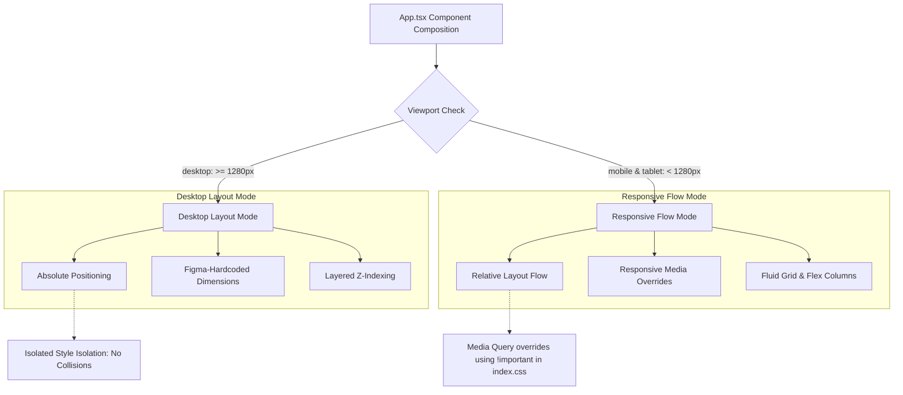

# 🎨 GenAI Website Styling & Desktop Architecture Guide

This comprehensive guide details the design philosophy, CSS structural properties, and pixel-perfect layout mechanisms implemented for the desktop and responsive viewports of the GenAI application.

---

## 🏛️ Core Styling Architecture

The project employs a robust **Dual-Viewport Layout System** that combines the raw visual precision of Figma coordinates for desktop viewports with a highly fluid, flex/grid-based layout system for mobile and tablet displays.



### 🔑 Key Principles:
1. **Isolated Viewport Integrity**: Desktop layout coordinates are hard-pinned to ensure absolute fidelity to the original Figma design, remaining completely safe from styling regressions.
2. **Fluid Media Query Overrides**: Under `< 1280px`, mobile overrides dynamically strip the hardcoded absolute positioning, converting grids, widths, and columns into percentage-based relative flows.
3. **Immersive Aesthetics**: Fully optimized for premium dark mode, combining sleek brand accent colors, neon glassmorphism, dynamic scrolling marquees, and ultra-smooth accordion transitions.

---

## 🖥️ Desktop Screen Layout & Properties

For screens $\ge 1280\text{px}$, the codebase represents a **direct, pixel-perfect translation** of Figma specs. Rather than relying on browser-default reflows, elements are positioned explicitly using detailed physical dimensions, absolute pinning, and deep z-index layers.

### 1. Absolute Positioning Strategy
Elements in desktop mode are placed within a wrapper absolute plane to achieve a 100% accurate layout.
* **Component-Level Coordinates**: Top, left, right, and bottom parameters are declared down to the exact pixel.
* **Exact Containers**: Fixed heights and widths prevent line-wrapping or layout shifts.

*Example snippet from [Hero.tsx](file:///c:/Users/91800/OneDrive/Desktop/Gen-Aipage/GenAi/src/components/Hero.tsx) (Desktop branch):*
```tsx
{/* Title Heading */}
<h1 style={{
    position: 'absolute', 
    width: '612px', 
    height: '174px', 
    right: '758px', 
    top: '200px',
    fontFamily: "'Inter', sans-serif", 
    fontWeight: 500, 
    fontSize: '48px', 
    lineHeight: '58px',
    display: 'flex', 
    alignItems: 'center', 
    color: '#FFFFFF'
}}>
  ...
</h1>

{/* Subtitle Paragraph */}
<p style={{
    position: 'absolute', 
    width: '569px', 
    height: '68px', 
    left: '70px', 
    top: '386px',
    fontFamily: "'Inter', sans-serif", 
    fontWeight: 400, 
    fontSize: '16px', 
    lineHeight: '34px',
    display: 'flex', 
    alignItems: 'center', 
    color: '#C2C2C2'
}}>
  ...
</p>
```

### 2. Desktop Layering & Z-Index System
With heavily overlapping layouts, `z-index` manages depth to maintain readability and element interaction:

| Z-Index Level | Scope / Role | Applied To Elements |
| :--- | :--- | :--- |
| `z-index: 20` | **Foreground Interactive** | Custom badges, buttons, clickable links, content labels, forms. |
| `z-index: 10` | **Layout Panels & Cards** | Container overlays, mockups, glassmorphic cards, active graphics. |
| `z-index: 1` | **Vector Backgrounds** | Grid dots, gradient vectors, subtle ambient circles. |

---

## 🎨 Tailwind CSS v4 & Styling Tokens

The project integrates **Tailwind CSS v4** via `@import "tailwindcss"` in [index.css](file:///c:/Users/91800/OneDrive/Desktop/Gen-Aipage/GenAi/src/index.css), declaring custom design variables within the new `@theme` configuration block.

### 1. Custom Theme Tokens
These variables standardise dark-mode layouts, primary brand colors, and responsive typography:

```css
@theme {
  /* Backgrounds & Containers */
  --color-bg-primary: #000000;
  --color-bg-card: #141414;
  --color-bg-card-hover: #1A1A1A;
  
  /* Brand Accent Colors */
  --color-orange: #FC6401;
  --color-orange-dark: #AE4501;
  --color-purple: #3E38E0;
  --color-green: #2BCE34;
  --color-blue: #2F6BFF;
  
  /* Typography Text States */
  --color-text-white: #F5F7FF;
  --color-text-gray: #C2C2C2;
  --color-text-muted: #A0A8B8;
  --color-text-dim: #999999;
  
  /* Borders */
  --color-border: #222222;
  --color-border-light: #2E2E2E;
  
  /* Typography Font Families */
  --font-inter: 'Inter', sans-serif;
  --font-poppins: 'Poppins', sans-serif;
  --font-open-sans: 'Open Sans', sans-serif;
  --font-space: 'Space Grotesk', sans-serif;
}
```

### 2. Premium Text Gradients
Dynamic typography gradients are declared via utility classes in `index.css`:

*   **Multi-Accent Brand Gradient** (`.gradient-text`):
    ```css
    .gradient-text {
      background: linear-gradient(90deg, #3E38E0 0%, #5B46C1 38.46%, #BF7759 72.12%, #F7921E 100%);
      -webkit-background-clip: text;
      -webkit-text-fill-color: transparent;
      background-clip: text;
    }
    ```
*   **Vibrant Peach-to-Orange Gradient** (`.gradient-text-orange`):
    ```css
    .gradient-text-orange {
      background: linear-gradient(270deg, #FFB889 35.58%, #FC6401 100%);
      -webkit-background-clip: text;
      -webkit-text-fill-color: transparent;
      background-clip: text;
    }
    ```

---

## ⚡ Interactive States & Micro-Animations

To ensure the desktop experience feels premium and responsive, several micro-animations and interaction layers are implemented:

### 1. Infinite Horizontal Scrolling Marquees
Used for displaying social proof and tool stacks at exactly 60fps:
```css
@keyframes scroll-left {
  0% { transform: translateX(0); }
  100% { transform: translateX(-50%); }
}

.animate-scroll-left {
  animation: scroll-left 30s linear infinite;
}
```
*   **Implementation Note**: Uses cloned markup buffers (`[1, 2].map(...)`) inside a `min-w-max` container to enable seamless, gapless looping across the desktop grid.

### 2. Glassmorphic Lighting Accents
Glow shadows create professional neon-backlight effects on cards and hover targets:
```css
.glow-orange {
  box-shadow: 0px 0px 20px rgba(252, 100, 1, 0.25);
}

.glow-purple {
  box-shadow: 0px 0px 20px rgba(62, 56, 224, 0.25);
}
```

### 3. Smooth Accordion Collapses
Controls FAQ transitions cleanly with strict max-height constraints:
```css
.faq-answer {
  max-height: 0;
  overflow: hidden;
  transition: max-height 0.4s ease, padding 0.4s ease;
}

.faq-answer.open {
  max-height: 300px;
  padding-top: 16px;
}
```

### 4. Custom Dark Mode Scrollbar Eraser
Hides distracting default system scrollbars globally to retain a sleek interface wrapper:
```css
::-webkit-scrollbar {
  display: none;
}
body {
  -ms-overflow-style: none; /* IE & Edge */
  scrollbar-width: none; /* Firefox */
}
```

---

## 🛡️ The Resiliency Layer: Responsive Decoupling

To prevent mobile and tablet viewports from breaking under the strict absolute pixel constraints of the desktop design, a powerful CSS override layer is configured.

### 1. Global Reset Rules
Under the `@media (max-width: 1279px)` media query in `index.css`, elements tagged with `.responsive-section` have their position, dimensions, margins, and transforms completely reset:

```css
@media (max-width: 1279px) {
  /* Reset page wrapper max-width */
  body {
    max-width: 100% !important;
  }

  /* Strip absolute placements from responsive wrappers */
  .responsive-section {
    position: relative !important;
    top: auto !important;
    left: auto !important;
    right: auto !important;
    bottom: auto !important;
    width: 100% !important;
    max-width: 100% !important;
    height: auto !important;
    margin: 60px auto 0 !important;
    transform: none !important;
    box-sizing: border-box !important;
  }
  
  /* Reset Typography sizes for small viewports */
  .responsive-section h2 {
    font-size: 22px !important;
    line-height: 1.3 !important;
    text-align: center !important;
  }
}
```

### 2. Flexible Flex & Grid Shifts
Sections adapt fluidly from rows to clean vertical stacks on mobile viewports:
```css
@media (max-width: 1279px) {
  .responsive-flex-row {
    flex-direction: column !important;
    align-items: center !important;
    width: 100% !important;
    height: auto !important;
    gap: 32px !important;
  }
}
```

---

> [!TIP]
> **Developing with this guide:**
> * When adding **new desktop elements**, use absolute values mapping to Figma coordinates.
> * When modifying **responsiveness**, do not modify inline CSS tags directly. Instead, add target media overrides inside the `@media (max-width: 1279px)` block of [index.css](file:///c:/Users/91800/OneDrive/Desktop/Gen-Aipage/GenAi/src/index.css) to preserve the pristine desktop layout.
